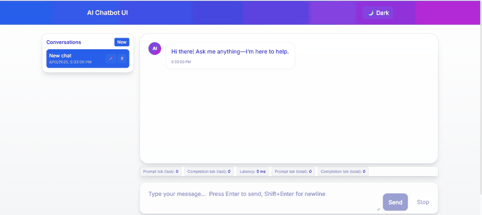

<p align="center">
  
</p>

<p align="center">
  <a href="https://your-frontend.vercel.app">
    
  </a>
  <a href="https://your-backend.onrender.com/api/health">
    
  </a>
  
</p>

# AI Chatbot UI (Vite + Express + Gemini)

A sleek, production-ready chat UI with streaming, dark mode, error handling, and optional Supabase persistence.

## ✨ Features

- Streaming responses via **Gemini** (`gemini-1.5-flash` by default)
- **Secure backend** (Express) — no API keys in the browser
- **Dark mode**, error banners, **Stop** button, client/server timeouts
- **Zustand** global state
- Optional **Supabase** persistence (fallback to localStorage if not configured)
- Token/latency **estimates** and clean Tailwind UI

---

## 🧱 Tech Stack

- **Frontend:** Vite + React + Tailwind, Zustand
- **Backend:** Node/Express (SSE streaming)
- **Model:** Google **Gemini** (via `@google/generative-ai`)
- **Persistence:** Supabase (Postgres) [optional]

---

## 🖥️ Local Development

```bash
# 1) install deps
npm install

# 2) env (create .env at project root)
#    If Supabase not set, app falls back to localStorage
cp .env.example .env
# fill GEMINI_API_KEY=... (and Supabase only on server)

# 3) run dev (Vite + Express concurrently)
npm run dev

# Frontend: http://localhost:5173
# Backend:  http://localhost:8787
# Health:   http://localhost:8787/api/health
# Diag:     http://localhost:8787/api/diag
```

> In dev, the Vite proxy forwards `/api/*` to the Express server (`vite.config.js`).

---

## 📚 What I Learned

- Implemented **streaming** token-by-token responses (SSE) with robust fallbacks.
- Built a **secure Node/Express backend** that hides API keys, adds rate-limits, timeouts, and retries.
- Designed a clean **React + Vite** UI with **Zustand** global state and **dark mode**.
- Added **persistence** with Supabase (and **localStorage** fallback).
- Production-grade **CI/CD**: GitHub Actions → build/test, deploy frontend to **Vercel** and backend to **Render** on `main`.
- Wrote a **clear README**, environment management, and **release process** (tags + GitHub Releases).

## 🔐 Environment Variables

**Backend (server only):**

```
GEMINI_API_KEY=sk-...
SUPABASE_URL=https://<your-project>.supabase.co      # optional
SUPABASE_SERVICE_ROLE=eyJhbGciOi...                  # optional; NEVER expose to frontend
PORT=8787                                            # platform may override in prod
NODE_ENV=production                                  # set by platform
```

**Frontend (build-time):**

```
VITE_API_BASE_URL=https://your-backend.example.com   # backend origin for production
```

> `VITE_*` variables are **exposed to the client** — do not put secrets there.

---

## 🔧 Production Tweaks

- Add a **start** script to `package.json`:
  ```json
  {
    "scripts": {
      "start": "node server/index.js"
    }
  }
  ```
- Ensure `.gitignore` contains:
  ```
  .env*
  node_modules
  dist
  ```

---

## 🚀 Deploy (One-Click-ish)

### Backend → Render (free tier friendly)

1. Push to GitHub.
2. On **Render**, **New Web Service** → connect repo.
3. **Build Command:** `npm install`
4. **Start Command:** `npm run start`
5. **Environment Variables:**
   - `GEMINI_API_KEY=...`
   - `SUPABASE_URL=...` (optional)
   - `SUPABASE_SERVICE_ROLE=...` (optional; **server only**)
   - `NODE_ENV=production`
6. After deploy, note the URL: `https://your-backend.onrender.com`

> Render will set `PORT` automatically; the server uses `process.env.PORT` when present.

### Frontend → Vercel (static build)

1. **New Project** → import same repo.
2. **Framework:** Vite → **Build Command:** `npm run build` → **Output:** `dist`
3. **Root Directory:** repo root (where `package.json` and `vite.config.js` live)
4. **Environment Variables:**
   - `VITE_API_BASE_URL=https://your-backend.onrender.com`
5. Deploy. Your site will be available at `https://your-frontend.vercel.app`

> Netlify works too (same Vite build), also set `VITE_API_BASE_URL` there.

## 📜 License

MIT
